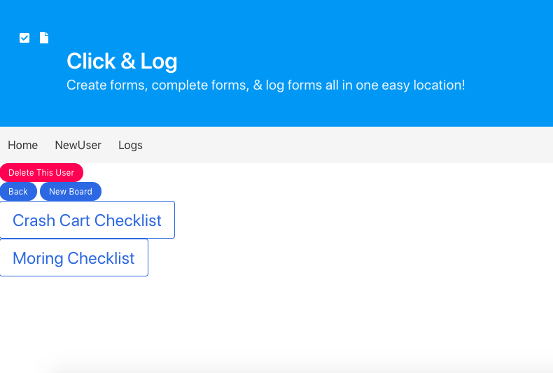
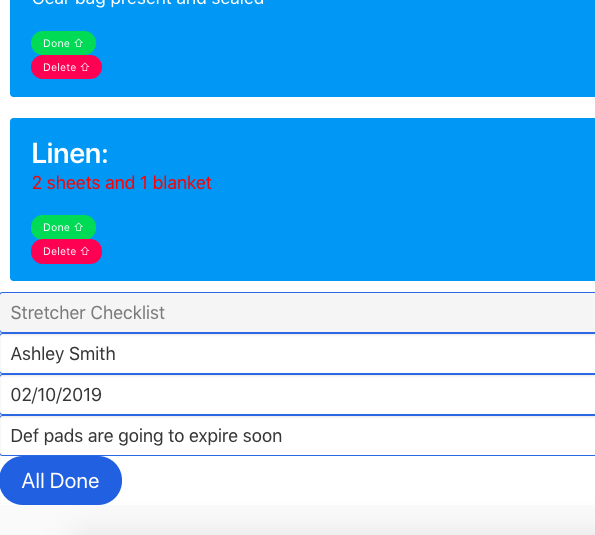
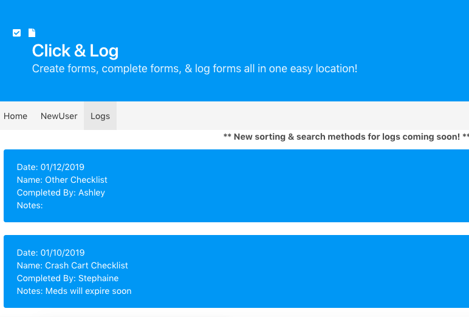

# Project2

Objective: Build a full stack App with Node/Express and Mongo/Mongoose from the ground up yourself.
==========

For My App I made 'Click & Log' a place to Create forms, complete forms, & log forms all in one easy location!
I have build Models, Users, which have Boards, and boards have tasks. Also Logs which have Inputs of when and what was completed.

**Site via Heroku**
https://protected-atoll-41733.herokuapp.com/
**Trello Board** 
https://trello.com/b/FITLymU4/project-2-mehn

##Pick From your checklist

##Click off fields and log it

##Check logs as needed

**A list of technologies, libraries, and/or frameworks used:**
- Bulma
- Font Awesome
- Express
- HBS
- Method-Override
- Node
- Nodemon
- Mongoose
- MongoDB
- Trello 
- Heroku

**In Version 2 I would love to include:**
- An an easier way to sort through the logs. Maybe a way to file them differently. 
- Username / password management.
- Different Styling Options Ex: colors

